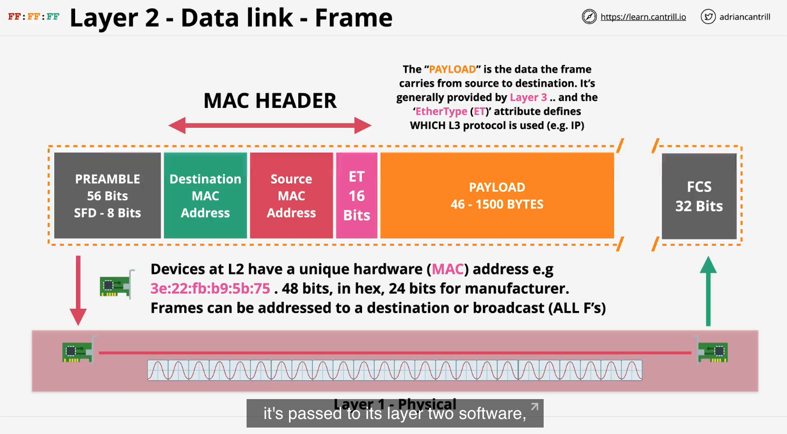
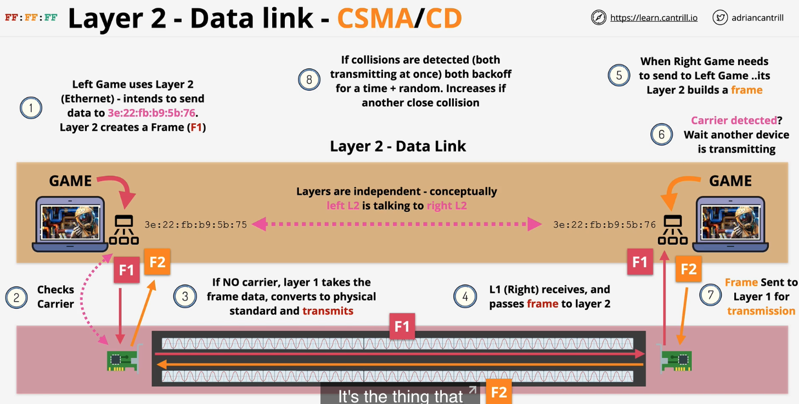
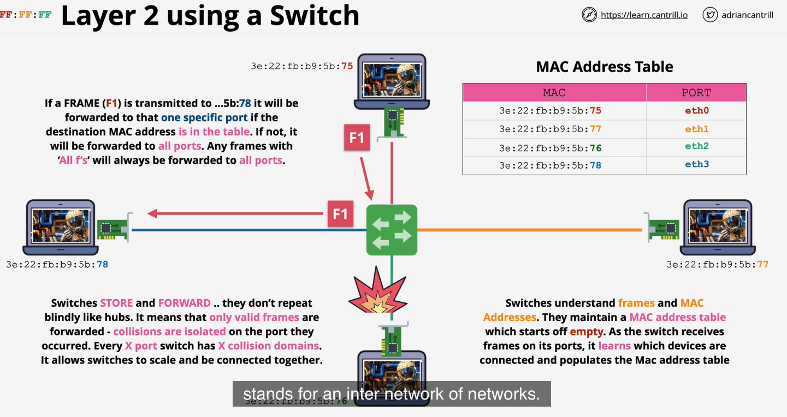

1. one of the most critical layers

- runs over layer 1. higher layers run over previous layers
- **FRAMES** is the format for sending data over network
  - frames have destination/source MAC address
  - have many fields. see img

2. network device is a switch
3. Devices have **MAC** addresses.

   - 48 bits hex address
     

4.uses **CSMA/CD** to prevent collisions

## part 2

5. uses MAC address as destination/source address
   - checks to see if carrier on medium
   - uses **CSMA** for this
     - carrier sense multiple access
6. **Encapsulation**
   - wrapping data in a package
7. collisions
   - if collision is detected, both nodes back off for a random time and try again
8. switches vs hubs

- hubs are layer 1 dont understand frames
- hubs act as a repeater
- aren't smart. dummy devices.
- prone to collisions

9. switches

- because it's layer 2, has a MAC table
- learn what's connected to each port
- are intelligent, store and forward frames based on MAC address
- won't forward collision

